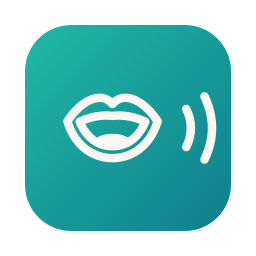

<div align="center">



<p>
  
  
  
</p>

</div>

---

# 🎙️ speech.md

**Voice transcription for macOS that runs entirely on your device.** No server, no
account, no audio leaving your Mac. Transcribes at **75x real time**, and foreign
terms come out spelled right at **zero latency cost**.

Built on `SpeechAnalyzer` and `SpeechTranscriber` (Apple Speech), with
`ScreenCaptureKit` to capture what the other people in a call are saying, and
Foundation Models for the optional refinement passes.

*Pst. Free, and it stays free :)*

## What it does

**Dictate** — one key, in any app. Hold it, speak, release, and the text is
pasted wherever your cursor is. Two quick taps keep it recording until the next
tap. Recording starts on the press either way, so nothing of the first word is
lost while the gesture is still being decided.

**Meetings** — records a meeting on two separate channels, your microphone and
the system audio, each with its own analyzer. Both transcripts stream in live,
side by side.

**Files** — drop in an audio file and get a transcript, along with how many
times faster than real time it ran.

**Microphone** — pick which input device dictation and your meeting track
listen to, or leave it on the system default.

**Dictionary** — voice shortcuts: say "my email" and your full address comes
out.

**Foreign terms** — the recognizer gets a vocabulary hint before it listens
(`AnalysisContext.contextualStrings`): the technical English people mix into
Portuguese, plus whatever is in your dictionary. "function" comes out spelled
right during transcription, at no latency cost. An optional second pass sends
still-unknown words through the on-device model, one word at a time; it is off
by default because it adds about a second before pasting.

**Markdown** — optional. An on-device model (Foundation Models) reformats the
dictation before pasting, turning spoken lists into bullets and fixing
punctuation.

## Performance

Measured on an Apple M5, macOS 26.6, `pt-BR` locale. Transcription in
low-latency mode, 27.7s of audio generated with `say`, three runs; model passes
against the real on-device model.

| Measure | Result |
| --- | ---: |
| File transcription | **75× real time** (27.7s of audio in 0.37s) |
| Vocabulary hint to the recognizer | **0s** (runs inside transcription) |
| Foreign-term pass, 1 word | 0.28s |
| Foreign-term pass, 2 words | 0.89s |
| Markdown, 14 words, model cold | 2.52s |
| Markdown, 14 words, prewarmed | 2.07s |
| Memory, app idle | 42 MB |

Both model passes are optional and off by default. The vocabulary hint is not:
it costs nothing, so "briefing", "deadline" and "function" come out spelled
right without any pass at all.

Every session prewarms the model when recording starts — the first response
carries the model load, and the seconds you spend speaking pay for it.

Formatting only runs when enabled, and it runs *after* transcription — it adds
latency between releasing the hotkey and the text appearing, not while you
speak.

The real-time figure measures file throughput, not the live experience. The
targets for sustained use — first partial under 300 ms, sustained lag under
600 ms — have not been measured over a long real session yet.

## Install

```sh
brew install Andsu-dev/tap/speech-md
```

Or grab the `.dmg` from the [latest release](https://github.com/Andsu-dev/speech.md/releases/latest)
and drag the app into Applications.

The app is signed with a local certificate, not notarized by Apple. The cask
clears the Gatekeeper quarantine flag on install, so it opens on the first
click. From the dmg macOS blocks the first launch — right click the app and
choose Open, or run `xattr -d com.apple.quarantine /Applications/speech.md.app`.

Runs on Apple Silicon, macOS 26 or later.

## Development

Xcode 26 or later.

```sh
./scripts/bundle.sh    # build the .app into dist/
./scripts/install.sh   # build and replace the installed app
./scripts/release.sh   # build, publish the zip and the dmg to a GitHub Release
```

`release.sh` prints the `version` and `sha256` to paste into the cask at
[Andsu-dev/homebrew-tap](https://github.com/Andsu-dev/homebrew-tap). Signing is
local — [docs/signing.md](docs/signing.md) explains why that matters for the
privacy permissions.

## Permissions

| Permission | Why |
| --- | --- |
| Microphone | Transcribe your voice |
| Screen Recording | Capture audio from the other participants |
| Accessibility | Paste dictated text into the focused app |

Screen Recording is only needed for the "Others" channel. Turn off "Áudio dos
outros participantes" in Settings and meetings run on the microphone alone,
without that permission.

## Architecture

```
Sources/SpeechMD/
├── App/          entry point
├── Speech/       SpeechPipeline, system audio capture
├── Dictation/    global dictation and text insertion
├── Meetings/     two-channel meeting recording
├── Files/        file transcription
├── Snippets/     voice shortcut dictionary
├── Formatting/   on-device Markdown and foreign-term passes
├── Island/       floating indicator by the notch
├── Settings/     preferences, global hotkey, permissions
└── Notetaker/    interface shell
```

Partial transcription never waits on formatting, summarization or persistence.
Those consumers receive events and can drop work when they fall behind.

## Status

Personal project, work in progress. Meetings and dictations live in memory —
closing the app discards them. Persistence is next.

The interface is in Brazilian Portuguese.

## License

MIT — see [LICENSE](LICENSE).
